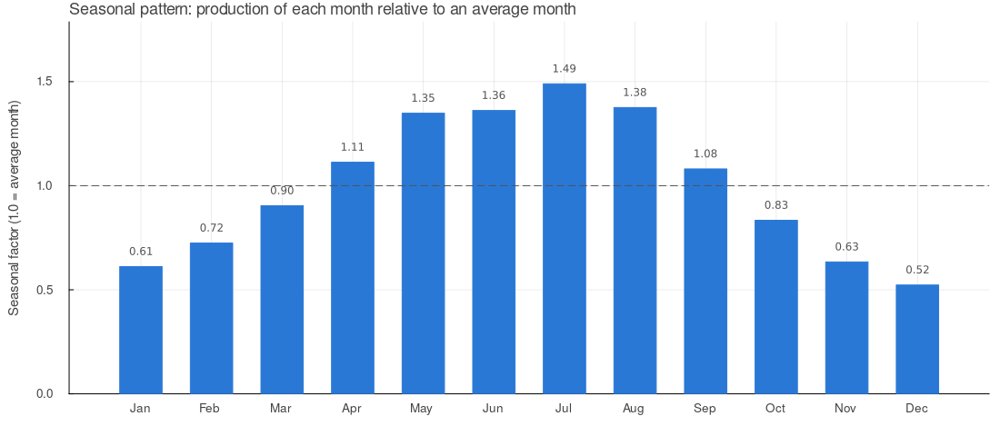
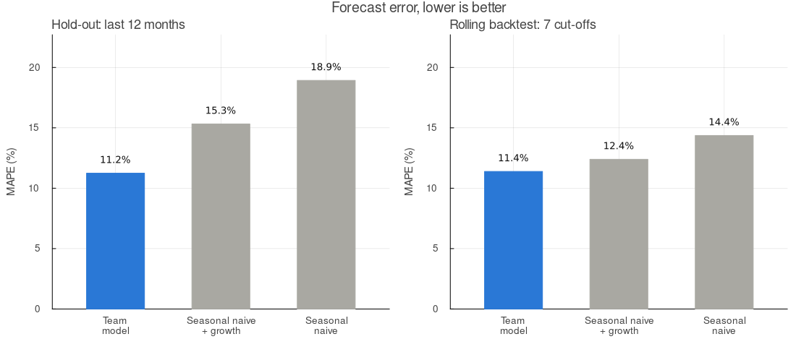
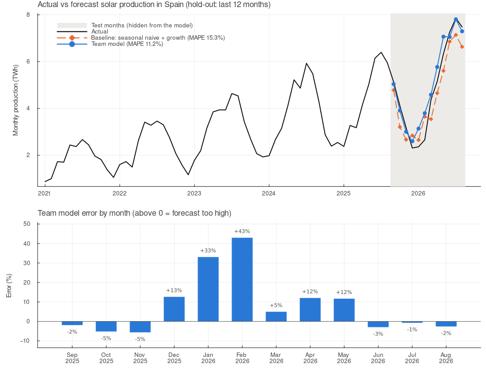
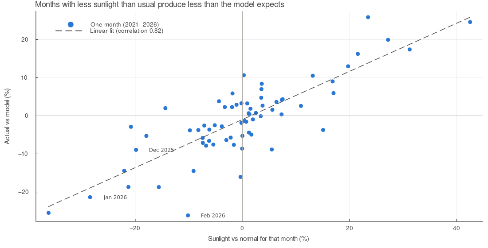

# SolarCastSpain.jl

<!-- DO NOT EDIT BELOW -->
[](../../actions/workflows/tests.yml)
[](../../actions/workflows/docs.yml)
<!-- DO NOT EDIT ABOVE -->


## Overview

<!-- DESCRIBE PROJECT PURPOSE BELOW -->
SolarCastSpain forecasts Spain's future monthly solar energy production using historical data from sources like ENTSO-E/REE and AEMET. The project models long-term solar panel capacity growth alongside seasonal patterns and efficiency losses caused by rising temperatures under various future warming scenarios.
<!-- DESCRIBE PROJECT PURPOSE ABOVE  -->

## Getting started

<!-- DO NOT EDIT BELOW -->
Clone the repository and start Julia in the project folder:

```bash
git clone https://github.com/KLU-BADS/project-4-scientific-programming-2026.git
cd project-4-scientific-programming-2026
julia --project=.
```
<!-- DO NOT EDIT ABOVE -->


<!-- DESCRIBE THE ESSENTIAL USAGE BELOW -->
Install the project's dependencies, plus Plots for the charts (needed only once):

```bash
julia --project=. -e 'using Pkg; Pkg.instantiate()'
julia -e 'using Pkg; Pkg.add("Plots")'
```

Then run the scripts from the project folder:

| Script | What it does |
|---|---|
| `julia --project=. scripts/run_validation.jl` | Validates the model against two simple baselines and prints the error measures |
| `julia --project=. scripts/plot_validation.jl` | Saves the actual vs forecast chart for the 12 test months |
| `julia --project=. scripts/run_forecast.jl` | Forecasts Sep 2026 – Dec 2028 under four warming scenarios and saves the tables |
| `julia --project=. scripts/plot_results.jl` | Saves the accuracy, seasonal pattern and sunlight charts |

All outputs are written to the `results/` folder.

The validation functions can also be used directly on any table with `month`
and `solar_gwh` columns, ordered by time:

```julia
using Project4
validate(seasonal_naive(), data).metrics   # (mae, rmse, mape, bias)
```
<!-- DESCRIBE THE ESSENTIAL USAGE ABOVE -->

## Results

### The model

Monthly solar production is modelled as

```
production = growth trend × seasonal factor × temperature efficiency
```

- **Growth trend:** a straight line fitted to all months, capturing the growth in installed solar capacity (about +700 GWh per month each year).
- **Seasonal factor:** how much each calendar month produces compared with an average month.
- **Temperature efficiency:** panels lose 0.4 % of their output for every °C above 25 °C.



July produces about 1.5 times an average month, December only about half.

### How accurate is the model?

We hid the most recent data, forecast it, and compared the forecast with what actually happened. The error is measured as MAPE, the average monthly miss in percent (lower is better).

- **Hold-out:** the model is trained on Jan 2021 – Aug 2025 and forecasts the last 12 months (Sep 2025 – Aug 2026).
- **Rolling backtest:** the same test repeated from 7 different starting points, then averaged. This is more reliable than a single test.

| Forecast method | Hold-out MAPE | Backtest MAPE |
|---|---|---|
| **Our model** | **11.2 %** | **11.4 %** |
| Seasonal naive + growth (same month last year × last year's growth) | 15.3 % | 12.4 % |
| Seasonal naive (same month last year) | 18.9 % | 14.4 % |



Our model beats both simple methods in both tests.



Summer and autumn are forecast within about 5 %. The largest errors are in December 2025 – February 2026 (up to +43 %), a winter with far less sunlight than usual.

### Forecast for 2027 and 2028

The model is fitted on all 68 months (Jan 2021 – Aug 2026). Future months use the typical temperature of each calendar month, plus 0, 1, 2 or 3 °C of warming.

| Year | No warming | +1 °C | +2 °C | +3 °C |
|---|---|---|---|---|
| 2027 | 71.09 TWh | 71.05 TWh (−0.06 %) | 70.98 TWh (−0.15 %) | 70.91 TWh (−0.25 %) |
| 2028 | 79.50 TWh | 79.46 TWh (−0.06 %) | 79.38 TWh (−0.15 %) | 79.30 TWh (−0.25 %) |

For comparison, our data shows about 51 TWh of solar production in 2025. Full tables: [`forecast_annual_summary.csv`](results/forecast_annual_summary.csv) and, month by month, [`forecast_monthly_scenarios.csv`](results/forecast_monthly_scenarios.csv).

### Limitations

**Sunlight hours are not used by the model.** Months with less sunlight than usual produce less than the model expects, and this explains much of the remaining error (correlation 0.82):



- **Temperature:** the efficiency loss is applied to monthly average *air* temperature above 25 °C. Spain's monthly averages rarely reach this, so the warming effect in the model is very small. Panels run much hotter than the air, so the real effect of warming is probably larger.
- **Straight-line trend:** the model assumes the same growth every year. This is reasonable for 1–2 years ahead, but uncertain further out.
- **Short history:** only 68 months of data are available.

### Conclusion

Spain's solar production is expected to keep growing strongly, from about 51 TWh in 2025 to about 79.5 TWh in 2028, driven mainly by new installed capacity. Within our model, warming reduces production only slightly: about 0.25 % per year even under +3 °C. The model forecasts unseen months with an average error of about 11 %, better than simple baseline methods. The most promising improvements are adding sunlight hours, using panel temperature instead of air temperature, and allowing growth to slow down over time.

## Tests

<!-- DO NOT EDIT BELOW -->
Tests are run automatically on GitHub for every push to `main` and on every pull request.

> [!TIP]
> To run the tests locally, run
> ```bash
> julia --project=. -e 'using Pkg; Pkg.test()'
> ```
 
<!-- DO NOT EDIT ABOVE -->


## Documentation

<!-- DO NOT EDIT BELOW -->
The [online documentation](https://klu-bads.github.io/project-4-scientific-programming-2026/) is automatically built and published to GitHub Pages on every push to `main`.

> [!TIP]
> To build the documentation locally, run
> ```bash
> julia --project=docs docs/make.jl
> ```
> and open `docs/build/index.html` in a browser.
>
> If building the documentation fails, run the tests locally before. 


<!-- DO NOT EDIT ABOVE -->

## Contributing

<!-- DO NOT EDIT BELOW -->
See [CONTRIBUTING.md](CONTRIBUTING.md).
<!-- DO NOT EDIT ABOVE -->

## License

<!-- DO NOT EDIT BELOW -->
MIT. See [LICENSE](LICENSE).
<!-- DO NOT EDIT ABOVE -->
