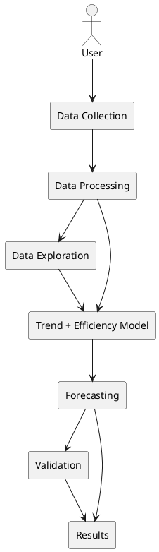
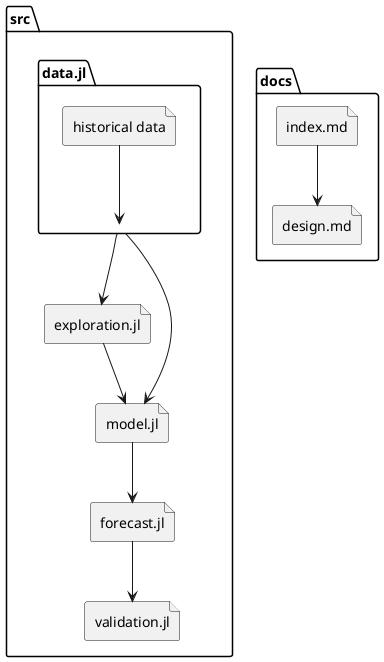
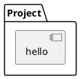

# Project design

This page describes the structure of the project: the components it is built from, what each one is responsible for, how they interact, what data they need, and what output they produce.

The main workflow is:

Data Collection → Data Processing → Data Exploration → Trend + Efficiency Model → Forecasting → Validation → Results

## Data

The project requires monthly data for Spain, including:

* Solar electricity production.
* Sunlight hours.
* Average temperature.

Solar production data will come from a public electricity data source such as **EMBER-ENERGY** or **ENTSO-E**. Temperature and sunlight data will come from **AEMET** or another suitable public meteorological source.

The data will be stored in a structured format so that it can be loaded and processed easily in Julia.

## Data Processing

The data processing component prepares the collected data for analysis.

It is responsible for:

* Loading the data into Julia.
* Making sure the dates are in the correct format.
* Combining the different datasets by month.
* Checking for missing values.
* Checking for unusual or invalid values.
* Preparing the final dataset for modelling.

The result is a clean dataset containing the variables needed by the forecasting model.

## Data Exploration

The data exploration component is used to understand the historical data before building the forecast.

It will include plots and simple calculations to investigate:

* How solar production changes over time.
* The seasonal pattern of solar production.
* The relationship between sunlight and solar production.
* How temperature changes over time.
* Whether there are unusual values or changes in the data.

This step helps us understand the data and identify patterns that should be included in the model.

## Trend + Efficiency Model

The model has two main parts.

First, a **trend component** estimates how solar production has changed over time. This represents the effect of increasing solar capacity and other long-term changes.

Second, an **efficiency component** represents the effect of temperature on solar panel efficiency. Higher temperatures can reduce the efficiency of photovoltaic panels, so the model applies a small efficiency adjustment when temperatures increase.

The model also takes the seasonal pattern into account because solar production varies strongly between months.

## Forecasting

The forecasting component uses the model to estimate future solar production.

The most recent real solar production data is used as the starting point. The model then applies:

* The estimated long-term growth trend.
* The seasonal pattern.
* The temperature efficiency adjustment.
* Different future warming scenarios.

This produces future monthly solar production estimates for Spain.

## Validation

The model will be tested using historical data.

Some of the most recent months will be temporarily removed from the dataset. The model will then forecast those months using only the earlier data.

The predicted values will be compared with the actual production values.

This allows us to measure how accurately the model can reproduce known historical production and identify areas where the model could be improved.

## Output

The project will generate:

* Plots showing historical solar production.
* Plots showing seasonal patterns and relevant variables.
* Forecasts of future monthly solar production.
* Forecasts under different temperature scenarios.
* Validation results comparing predicted and actual production.
* Measures of forecast accuracy.

The main output will be visualizations and numerical results that show how Spain's solar production could change in the future.

## Component Interaction

The components interact in the following order:

The **Data Collection** component provides the raw data to **Data Processing**. The processed data is then used for **Data Exploration** and for building the model.

The **Trend + Efficiency Model** uses the historical data and information learned during data exploration. The resulting model is used by the **Forecasting** component to produce future estimates.

The forecasts are passed to **Validation**, where they are compared with known historical values. Both the forecasts and validation results are then used to produce the final **Results**.

## Project Structure

The project will be implemented in Julia. The main parts of the project will be separated into files or modules based on their responsibilities.

**A** possible structure is:

The exact file structure may change during development, but each component will have a clear responsibility. This makes the project easier to understand, test, and modify.

## Implementation

The project will use Julia for data processing, modelling, forecasting, and visualization.

The implementation will focus on keeping the model simple and understandable. Each major step will be separated so that the data processing, model, forecasting, and validation can be tested independently.

This structure also makes it possible to change one part of the project, such as the temperature effect or forecasting method, without having to rewrite the entire project.

## Components

This package has one component named `hello` which provides a function `hello()`.

## Behaviour

The `hello()` function prints "Hello World".

```plantuml
@startuml
left to right direction
(*) --> "print"
"print" --> (*)
@enduml
```

